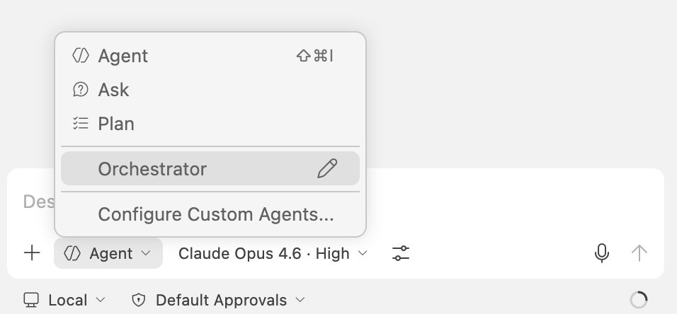

# My Agent Team

A four-agent chain that takes a software specification from planning to pull request. An **Orchestrator** governs the workflow, a **Builder** writes the code, a **Reviewer** evaluates it, and a **Shipper** prepares the PR.

## How It Works

1. Start with the **Orchestrator** — it reviews the spec for ambiguity, declares scope, and drives the process.
2. The Orchestrator runs the **Builder** as a subagent to implement the spec.
3. The Orchestrator runs the **Reviewer** as a subagent to evaluate the output (PASS or FAIL).
4. On PASS, the Orchestrator runs the **Shipper** as a subagent to prepare the pull request.

The chain includes human checkpoints for spec clarification and architectural decisions. See [AGENTS.md](AGENTS.md) for full details on conventions and agent behavior.

## Usage

The Orchestrator uses VS Code's [subagent pattern](https://code.visualstudio.com/docs/copilot/agents/subagents) to invoke the Builder, Reviewer, and Shipper automatically — no manual switching required. Only the Orchestrator appears in the agent picker; the other agents run as subagents within the Orchestrator's session.

### Start the chain

Select **Orchestrator** from the agent picker and give it a spec:



```
Implement the spec in docs/specs/user-registration.md
```

The Orchestrator reviews the spec for ambiguity, asks clarifying questions, then automatically drives the Builder → Reviewer → Shipper chain. You'll see each subagent appear as a collapsible tool call in the chat — expand to view details.

You can also point it at an issue or inline requirements:

```
Implement the requirements in issue #42
```

### Human checkpoints

The chain pauses for your input at two points:

1. **Spec ambiguity** — before work begins, if the Orchestrator finds requirement-level gaps.
2. **ADR confirmation** — before the Shipper runs, if a major architectural decision was made.

### If the build loop fails

If the Reviewer returns FAIL, the Orchestrator re-runs the Builder with the issue list. After two consecutive failures on the same issues, it escalates to you for guidance.

> **Note:** Always start with the Orchestrator. The Builder, Reviewer, and Shipper are not directly selectable — they run only as subagents of the Orchestrator.
